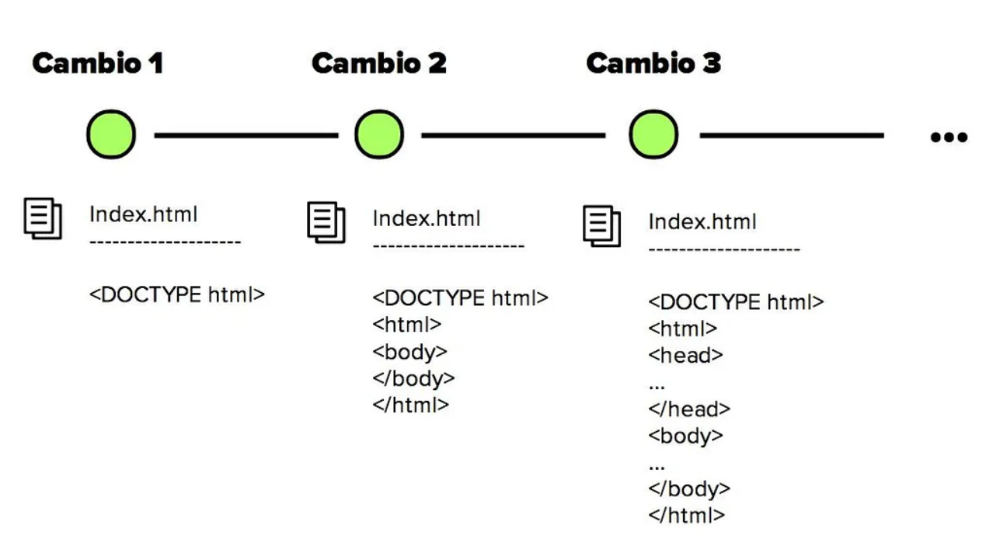
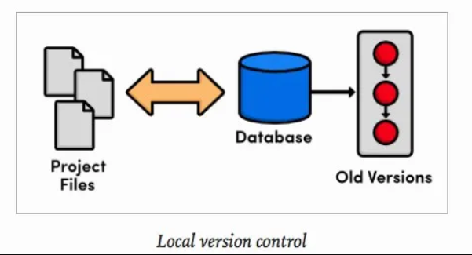
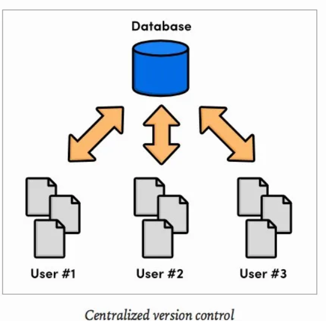
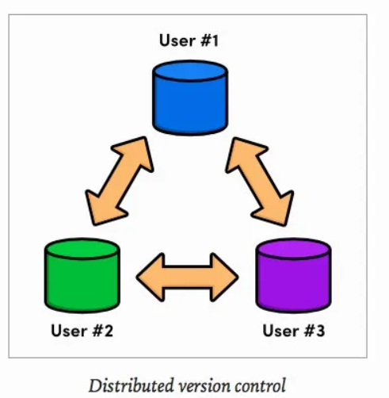
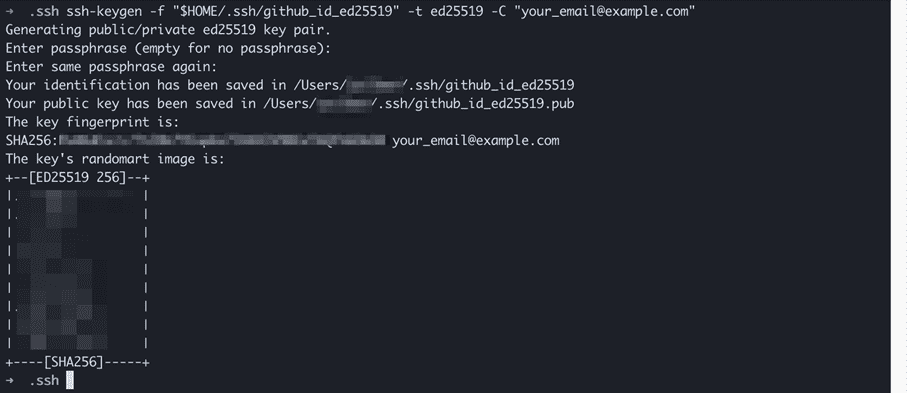
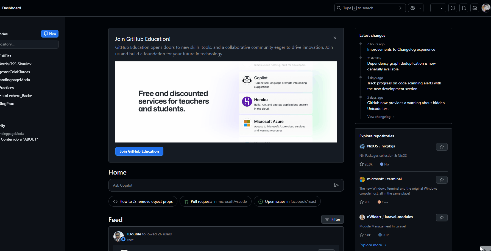
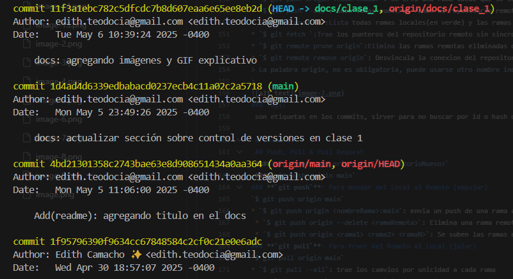
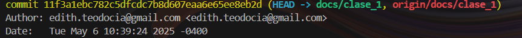
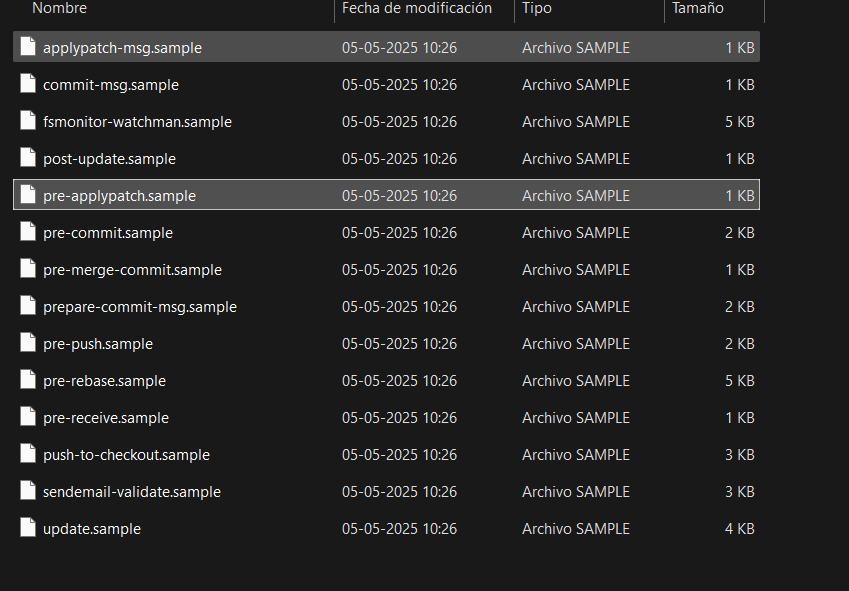
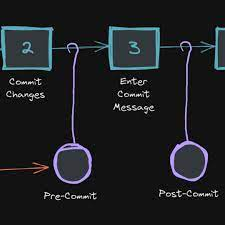

# Curso GitHub
 
<details open>
  <summary><strong>Clase 1 – Introducción al Control de Versiones y Git</strong></summary>

<br>
<h2 align="center">¿Qué es un control de versiones?</h2>

El control de versiones es un sistema que registra los cambios realizados sobre un archivo o conjunto de archivos a lo largo del tiempo de tal manera que sea posible recuperar versiones especificas más adelante. Permite:
 
- ✅ Llevar un historial completo de modificaciones.<br>
- 👤 Saber quién hizo qué y cuándo.<br>
- 🔄 Revertir errores fácilmente.<br>
- 🤝 Trabajar en equipo sin conflictos.<br>
   
<p align="center">

</p>
 
Los sistemas de control de versiones han ido evolucionando a lo largo del tiempo y podemos clasificarlos en tres tipos: **Locales**, **Centralizados** y **Distribuidos**.

 ### <p align="center"><strong>📁 Sistemas de Control de Versiones Locales</strong></p>

Los sistemas locales almacenaban versiones en bases de datos en lugar de múltiples archivos. Solo se tenía una copia activa del proyecto, evitando confusión o eliminación de versiones.

<p align="center">

</p>

👉 Se trabajaba en el computador personal del desarrollador, sin una forma eficiente de compartir el código.

### <p align="center"><strong>🌐 Sistemas de Control de Versiones Centralizados</strong></p>

Para facilitar la colaboración, se comenzó a usar un servidor central donde se almacenaban los cambios y versiones.

<p align="center">

</p>

📌 Problema: conflictos al editar el mismo archivo.<br>
🛠️ Solución: gestionar conflictos manualmente.<br>
😰 Limitación: ineficiente en equipos grandes con actualizaciones frecuentes.<br>

### <p align="center"><strong>🌍 Sistemas de Control de Versiones Distribuidos</strong></p>

Cada desarrollador tiene una copia local completa del proyecto.

<p align="center">
  
</p>

🔄 Trabaja localmente sin depender de un servidor.
✅ Más seguro ante caídas del servidor.
🤝 Mejor resolución de conflictos y trabajo simultáneo.

---

## <h2 align="center">Importancia de un control de versiones</h2>

- 🔁 **Seguimiento de cambios:** puedes ver y revertir cualquier modificación.
- 🤝 **Colaboración eficiente:** varios desarrolladores trabajando al mismo tiempo.
- 🔒 **Seguridad:** conserva la integridad de los archivos.
- 🔄 **Flexibilidad:** no necesitas un desarrollo lineal.

---

## Historia breve

| Año  | Evento                                                        |
|------|---------------------------------------------------------------|
| 1990 | Nace CVS, cada archivo tenía su propia versión con un número. |
| 2005 | Linus Torvalds crea Git tras la caída de BitKeeper.          |
| 2008 | Se crea GitHub con Ruby on Rails.                             |
| 2018 | Microsoft compra GitHub.                                      |
| 2024 | Git sigue dominando el mercado (GitHub, GitLab, Bitbucket).   |

---

 ## <h2 align="center">¿Qué es Git?</h2>

Git es un **sistema de control de versiones distribuido**. Cada desarrollador tiene una copia completa del proyecto (repositorio) en su equipo.

Permite:

- Trabajar sin conexión.
- Realizar commits y pruebas locales antes de compartir cambios.
- Rastrear todo el historial del proyecto de forma segura.

---

## <h2 align="center">¿Qué es un repositorio?</h2>

Un repositorio es el **almacén donde se guardan los archivos del proyecto y su historial**. 

📚 Metáfora: Es como una estantería con libros, donde cada libro representa una versión diferente del proyecto.

<div align="center">
  <a href="" title="Estante de Libros">
    
  </a>
</div>

---

## 🚀 Primeros Pasos
1.  **Crea tu cuenta en GitHub**  
👉 Regístrate en [github.com](https://github.com/)
2. **Instala Git**
👉 Descarga desde [git-scm.com](https://git-scm.com/) y sigue las instrucciones para tu sistema operativo.
3. **Configura tu usuario global**
Abre la terminal y ejecuta:
  ```bash
   git config --global user.name "Tu Nombre"
   git config --global user.email "tuemail@example.com"
   ```
4. **Verifica la configuración**
```bash
    git config --list
```
---
<details open>
<summary><strong>🔐 Para no iniciar sesión cada vez: conectar GitHub con SSH</strong></summary>
<br>
Conectar por SSH permite autenticarse sin ingresar usuario/contraseña cada vez que haces <code>git push</code> o <code>git clone</code>.

1. **Genera una nueva clave SSH:**
```bash
ssh-keygen -t ed25519 -C "tuemail@example.com"
```

2. **Agrega tu clave SSH al agente de autenticación:**
```bash
eval "$(ssh-agent -s)"
ssh-add ~/.ssh/id_ed25519
```

3. **Copia tu clave pública:**
```bash
cat ~/.ssh/id_ed25519.pub
```

4. **Agrega la clave pública en GitHub:**
- Ve a GitHub → Settings → SSH and GPG keys → **New SSH key**
- Pega la clave y guarda

5. **Prueba la conexión:**
```bash
ssh -T git@github.com
```
Si todo está correcto, verás un mensaje de bienvenida.

<p align="center">
 
  
</p>

</details>

---

### <h2 align="center">Iniciando un proyecto en Git</h2>

1. Crear el repositorio en GitHub (sin README, `.gitignore`, ni licencia).
<p align="center">  </p>

2. Clonar el repositorio:
```bash
git clone https://github.com/usuario/nombre-del-repo.git
cd nombre-del-repo
```
3. Agregar tus archivos y hacer el primer commit:
```bash
git add .
git commit -m "feat: proyecto base inicial"
```
4. Subir los cambios a GitHub:
```bash
git push origin main
```


---

## <h2 align="center">Los 3 estados de Git</h2>

| Estado    | Descripción                                                                 |
|-----------|-----------------------------------------------------------------------------|
| Modified  | Archivo creado, eliminado o modificado pero sin agregar para commit.       |
| Staged    | Archivo listo para ser guardado (commit).                                  |
| Committed | Archivo ya guardado en el repositorio local.                               |

---

## <h2 align="center">Cambiar de estado</h2>

1. Ver el estado actual:
```bash
git status
```

2. Pasar archivo a la etapa de **Staged**:
```bash
git add README.md
```

3. Guardar cambios (hacer commit):
```bash
git commit
```
Se abrirá un editor donde debes escribir el mensaje del commit. Luego guarda y cierra.

4. Ver todo el historial de commits:
```bash
git log
```
 Te mostrara lo siguiente: 
 


---

## <h2 align="center">¿Qué es un Commit?</h2>

Un **punto de guardado** que captura el estado actual del proyecto.

Contiene:

- Fecha
- Autor
- Mensaje descriptivo
- Archivos afectados

✅ Para hacer un commit, los archivos deben estar en estado **Staged**.

---

## <h2 align="center">¿Qué es el HEAD?</h2>

`HEAD` es un **puntero que indica en qué commit estás actualmente**.

Se puede ver con:
```bash
git log
```

Ejemplo:
 

---

## <h2 align="center">Comandos útiles de Git</h2>

| Comando | Descripción |
|--------|-------------|
| `git add .` | Agrega todos los archivos al área de preparación (Staged). |
| `git rm <archivo>` | Elimina el archivo del área de preparación. |
| `git commit -m "mensaje"` | Hace commit sin abrir editor. |
| `git commit --amend -m "nuevo mensaje"` | Cambia el mensaje del último commit. |
| `git commit -am "mensaje"` | Agrega y hace commit de todos los archivos rastreados. |
| `git checkout <id_commit>` | Cambia el HEAD a un commit anterior. |


</details>

<br>
 
<details open>
  <summary><strong>Clase 2: Ramas, Merge y Conflictos</strong></summary>

<br>

### 🌱 ¿Qué es una rama (branch)?
Una rama es una **instantánea** del código, como una línea paralela para trabajar sin afectar el código principal.

### 🎯 ¿Para qué sirven?
Permiten:
- Desarrollo paralelo
- Colaboración sin conflictos
- Pruebas aisladas

---

### ✍️ Crear y ver ramas
```bash
git branch                   # Ver ramas existentes
git branch <nombre>         # Crear nueva rama
git switch <nombre>         # Cambiar de rama (alternativa a checkout)
git checkout <nombre>       # Cambiar de rama
```

---

### 🔀 Fusionar ramas (merge)
```bash
git merge <rama>            # Fusiona la rama con la actual
git merge <rama> --no-ff    # Evita fast-forward, mantiene historial
```
Cuando fusionas, Git intenta mezclar los cambios. Si todo va bien, listo.

---

### 🧹 Eliminar ramas
```bash
git branch -d <rama>        # Elimina rama (después de fusionarla)
git branch -a               # Ver todas las ramas locales y remotas
```
🧠 Es buena práctica eliminar ramas que ya cumplieron su propósito.

---

### ⚠️ Conflictos en Git
Cuando dos ramas modifican **las mismas líneas** de un archivo → conflicto.

### 🛠️ Resolviendo conflictos
Git marcará el archivo así:
```txt
<<<<<<< HEAD
(cambios de tu rama actual)
=======
(cambios de la rama que estás fusionando)
>>>>>>>
```
Debes elegir:
- 🟢 Quedarte con los cambios de tu rama
- 🔵 Quedarte con los cambios de la otra rama
- ✏️ Editar y combinar ambos manualmente

Luego de resolver:
```bash
git add archivo_conflictivo.txt
git commit -m "Conflicto resuelto"
```
---
### ✏️ Cambiar el nombre de una rama

###### Estando en la rama que deseas renombrar
```bash
git branch -m nuevo-nombre
```
###### Renombrar otra rama (sin estar dentro de ella)

```bash
git branch -m viejo-nombre nuevo-nombre
```

---

</details>

<br>
 
<details open>
  <summary><strong>Clase 3 – GitHub y Repositorios Remotos</strong></summary>

<br>

### 🧠 ¿Git y GitHub son lo mismo?
- **Git**: sistema de control de versiones.
- **GitHub**: plataforma en la nube para alojar proyectos Git y colaborar.

### 🧠 ¿GitHub es único?
No, existen otras plataformas como:
- **Bitbucket**: enfocado en repositorios privados, de Atlassian.
- **GitLab**: plataforma DevOps completa, también basada en Git.

---

### 🌐 ¿Qué es un repositorio remoto?
Un repositorio en línea que actúa como punto de sincronización entre varios repositorios locales.

---

### 🔗 Enlazar un repositorio local con remoto
```bash
git remote add origin <url>         # Enlazar con remoto
git remote -v                       # Verificar remotos
```
📌 *"origin"* es el alias estándar para el repositorio principal.

---

### 📥 Clonar repositorio
```bash
git clone <url_repositorio>         # Clona el repositorio remoto
```

---

### 📤 Subir al repositorio remoto
```bash
git push origin <rama>              # Enviar rama al remoto
```

---

### 🌱 Crear ramas remotas y sincronizar
```bash
git branch -a                       # Ver todas las ramas

# Cambiar a una rama remota
git switch <rama_remota>

# Traer ramas del remoto
git fetch

# Limpiar referencias remotas eliminadas
git remote prune origin
```
---

### 🧹 Eliminar ramas locales obsoletas
Usar `git branch -d <rama>` cuando ya no se necesiten.

---
</details>

<br>
 
<details open>
  <summary><strong>Clase 4 – Push, pull & pull request</strong></summary>

<br>

## 🚀 git push

### 📌 ¿Qué hace?
`git push` sirve para **enviar (empujar)** los cambios del repositorio local al repositorio remoto.

```bash
git push origin <rama>
```

Ejemplo:
```bash
git push origin main
```

---

### 🎯 Comandos útiles de `git push`

```bash
git push                          # Empuja los cambios actuales al remoto

git push -u origin <rama>         # Empuja y guarda la rama como upstream

git push --all                    # Empuja todas las ramas locales

git push origin <rama1> <rama2>  # Empuja varias ramas

git push -f                       # Fuerza el push (¡Peligroso!)

git push -d origin <rama>         # Borra una rama remota
```

---

### ⚠️ Errores comunes con `git push` y soluciones

- **Error:** rejected (non-fast-forward)
  - ✅ Solución: Haz un `git pull` antes del `push`

```bash
git pull origin main
```

- **Error:** "Updates were rejected because the remote contains work that you do not have."
  - ✅ Solución: Primero sincroniza con `git pull`, resuelve conflictos, luego `git push`

- **Peligro:** `git push -f`
  - ❌ Puede sobreescribir cambios ajenos
  - ✅ Úsalo solo si sabes lo que haces y nunca en `main` o `develop`

---

## 🔄 git pull

### 📌 ¿Qué hace?
`git pull` sirve para **traer (jalar)** los cambios del repositorio remoto al local.

```bash
git pull origin <rama>
```

Ejemplo:
```bash
git pull origin main
```

---

### 🎯 Comandos útiles de `git pull`

```bash
git pull                             # Trae cambios de la rama por defecto

git pull --set-upstream origin <rama>  # Establece upstream y trae cambios

git pull --all                        # Trae cambios de todas las ramas remotas

git pull origin <rama1> <rama2>       # (No recomendado, puede ser confuso)
```

---

### ⚠️ Errores comunes con `git pull` y soluciones

- **Conflictos de fusión (merge conflicts)**
  - ✅ Solución: Edita los archivos conflictivos y resuelve manualmente.
  - Luego ejecuta:

```bash
git add .
git commit -m "Conflictos resueltos"
```

---

## 🔃 Pull Request (PR)

### ✅ ¿Cómo se hace una PR?
1. Sube tu rama con `git push`:

```bash
git push origin feature-rama
```

2. Luego en GitHub:
   - Opción 1: Si la rama fue subida recién, te aparece el botón "Compare & pull request"
   - Opción 2: Ir a la pestaña **Pull Request** > "New Pull Request"

---

### 💡 Buenas prácticas para una PR
- Realiza una sola funcionalidad por PR
- Escribe una descripción clara
- Adjunta imágenes, GIFs o videos si es posible

---

### 🔍 Revisar una PR
- Sé positivo al dar feedback
- Sé claro y conciso
- Entiende el contexto del código

---

</details>

 
<details open>
  <summary><strong>Clase 5 – GitFlow, GitHub Flow y Trunk Based</strong></summary>

<br>

## 📘 ¿Qué es GitFlow?
Es la forma en que un equipo utiliza Git para trabajar colaborativamente, siguiendo ciertas pautas y estructura de ramas.

## 🌳 Estructura del Git Flow


## 📌 Ramas del Git Flow

- `master`: Contiene el código listo para producción.
- `develop`: Contiene el código en desarrollo, listo para pruebas.
- `feature/<nombre>`: Se crea desde `develop` para nuevas funcionalidades.
- `release/<nombre>`: Se crea desde `develop` para preparar una nueva versión.
- `hotfix/<nombre>`: Se crea desde `master` para corregir errores urgentes.

## 🔧 Comandos comunes con Git Flow

> Usar git-flow:

```bash
git flow init             # Inicializa el flujo Git Flow

git flow feature start nombre     # Inicia una nueva feature

git flow feature finish nombre    # Finaliza y fusiona la feature a develop

git flow release start v1.0.0     # Inicia una release

git flow release finish v1.0.0    # Finaliza y fusiona a master y develop

git flow hotfix start fix-bug     # Inicia un hotfix

git flow hotfix finish fix-bug    # Finaliza y fusiona a master y develop
```

---

## 🔄 GitHub Flow

- Solo existe la rama `master` y cualquier rama nueva debe integrarse mediante una Pull Request.

```text
master
  \
   feature-x  --> Pull Request --> merge a master
```
---

## 🔁 Trunk Based Development

- Se trabaja directamente en `master`, con ramas auxiliares muy pequeñas y de vida corta.
- Ideal con buena integración continua (CI/CD).

---

## 🧠 Ship / Show / Ask

### 1. 🚀 Ship
- Se hace merge directamente a `master` sin revisión.

### 2. 👀 Show
- Se crea una PR que se fusiona inmediatamente, solo para que CI revise los cambios.

### 3. ❓ Ask
- Se crea una PR para discutir y revisar los cambios antes de fusionarlos.

---

## ✅ Requisitos para usar Ship / Show / Ask

- Sistema de CI/CD funcionando
- Confianza en el equipo
- Buenas prácticas de desarrollo
- Ramas pequeñas, de vida corta, saliendo desde `master`
- Responsabilidad individual

---
</details>

<details open>
  <summary><strong>Clase 6 – Buenas prácticas en Git y Deshacer Cambios</strong></summary>

<br>

#### ¿Para qué sirven las buenas prácticas?
- Son estándar en equipos profesionales
- Facilitan la resolución de conflictos
- Hacen el historial de commits más claro
- Permiten trabajar en equipo de forma efectiva
- Ayudan a revisar y auditar el código fácilmente

#### 📌 ¿Cada cuánto debería hacer un commit?
- **A menudo**: mejor varios commits pequeños que uno grande
- No hacer commits sin sentido
- Hacer commit por funcionalidad o cambio específico
- Evitar mezclar cambios no relacionados en un mismo commit

#### 📝 Escribir buenos commits
- Usa el **modo imperativo** (Add, Fix, Remove, etc.)
- No uses punto final ni puntos suspensivos
- Máximo 50 caracteres en el título
- Agrega contexto en el cuerpo del mensaje si es necesario
- Usa prefijos semánticos:
  - `style:` cambios de formato
  - `test:` test o refactor de tests
  - `feat:` nueva funcionalidad
  - `fix:` corrección de errores
  - `perf:` mejoras de rendimiento
  - `build:` tareas de despliegue
  - `ci:` integración continua
  - `docs:` documentación
  - `refactor:` refactorización

#### 🌿 Nombres de ramas
- Usa nombres consistentes y descriptivos
- Incluye acción + ID de tarea si aplica (ej. `feat/login-form-123`)
- Evita usar nombres genéricos como `nueva-rama` o `prueba`

---

### ♻️ Deshacer cambios en Git

#### ¿Cuándo deshacer?
- El proyecto dejó de funcionar
- Recuperar código eliminado
- Revertir cambios incorrectos
- Limpiar historial antes de hacer push

#### 🧨 Comandos destructivos vs no destructivos
- **Destructivos** modifican el historial (reset --hard, rebase mal usado)
- **No destructivos** preservan historial (revert, checkout sin push)

#### 🔧 Comandos útiles
- `git reset`
  - `--soft`: mantiene los cambios en staging
  - `--mixed`: remueve del área de staging, conserva en working dir
  - `--hard`: elimina del área de staging y working directory
- `git revert`
  - Crea un commit nuevo que revierte otro commit
- `git checkout`
  - Recupera archivos específicos de commits anteriores
  - También permite cambiar de rama
- `git restore`
  - Reemplaza `checkout` para restaurar archivos

#### 🧠 Comandos comunes para deshacer:
```bash
git reset --hard HEAD~<N>
git reset --soft HEAD~<N>
git reset --mixed HEAD~<N>
git reset --hard <SHA>
git reset --soft <SHA>

git revert HEAD~<N>
git revert <SHA>

git checkout HEAD~<N>
git checkout <SHA>

git restore archivo.ext
```

#### ⚠️ Consejos al deshacer:
- Siempre haz backup antes de usar `reset --hard`
- Evita usar comandos destructivos en ramas compartidas
- Usa `revert` si ya hiciste push y necesitas deshacer un cambio

---

</details>


<details open>
<summary><strong>Clase 7: Hooks, Alias y Trucos de Git</strong></summary>
<br>

---

### 🔧 ¿Qué son los Git Hooks?
Scripts que se ejecutan automáticamente en ciertos eventos del ciclo de vida de Git (antes de un commit, después de un push, etc.).  
🔄 Se usan para **automatizar tareas**, mejorar la calidad del código y prevenir errores.

---

### 📁 Ubicación
Los hooks se encuentran en:  `.git/hooks/`


Por defecto vienen archivos de ejemplo con extensión `.sample`.

---

### 🔥 Hooks del lado del cliente:
Solo afectan al repositorio local en el que estan y su mayor desventaja es que sus acciones solo ocurriran para ti, siendo que tu equipo no tendra estos beneficios.

Tipos de hooks:

- pre-commit
- prepare-commit-msg
- commit-msg
- post-commit
- pre-push
- post-checkout y post-merge

    

### Hooks más usados

| Hook        | Momento de ejecución       | Uso común                     |
|-------------|-----------------------------|-------------------------------|
| `pre-commit` | Antes del `git commit`      | Ejecutar linter, pruebas, formateo |
| `commit-msg` | Valida el mensaje del commit | Forzar formato correcto       |
| `pre-push`   | Antes del `git push`         | Ejecutar tests                |

---

### 🛠 Cómo crear un Git Hook manualmente
1. Ir al directorio `.git/hooks/`
2. Crear un archivo con el nombre del hook, sin extensión (`pre-commit`, `pre-push`, etc.)
3. Darle permisos de ejecución:
   ```bash
   chmod +x pre-commit
   ```
## 💻 Alias y Trucos de Git

### ⚡ Alias de Git
Los alias son una forma de **acelerar tu flujo de trabajo** y hacer más eficiente el uso de Git. Permiten crear comandos cortos para comandos largos o complejos.

#### Ejemplos de alias útiles:
- `git st` -> `git status`
- `git co` -> `git checkout`
- `git br` -> `git branch`
- `git ci` -> `git commit`
- `git lg` -> Un log de commits más legible.

#### Cómo crear un alias en Git:
Para crear un alias de Git, puedes usar el comando `git config`:

```bash
git config --global alias.st status
```
 **Alias mas utilizados:**
 - Ver log de commits de manera legible: 
    ```bash
    git config --global alias.lg "log --oneline --graph --all --decorate
    ```
 - Ver todos los remotos: 
    ```bash
    git config --global alias.remotes "remote -v"
    ```
 - Ver las diferencias entre los archivos modificados: 
    ```bash
    git config --global alias.diff-all "diff --color=auto --stat"
    ```

</details>